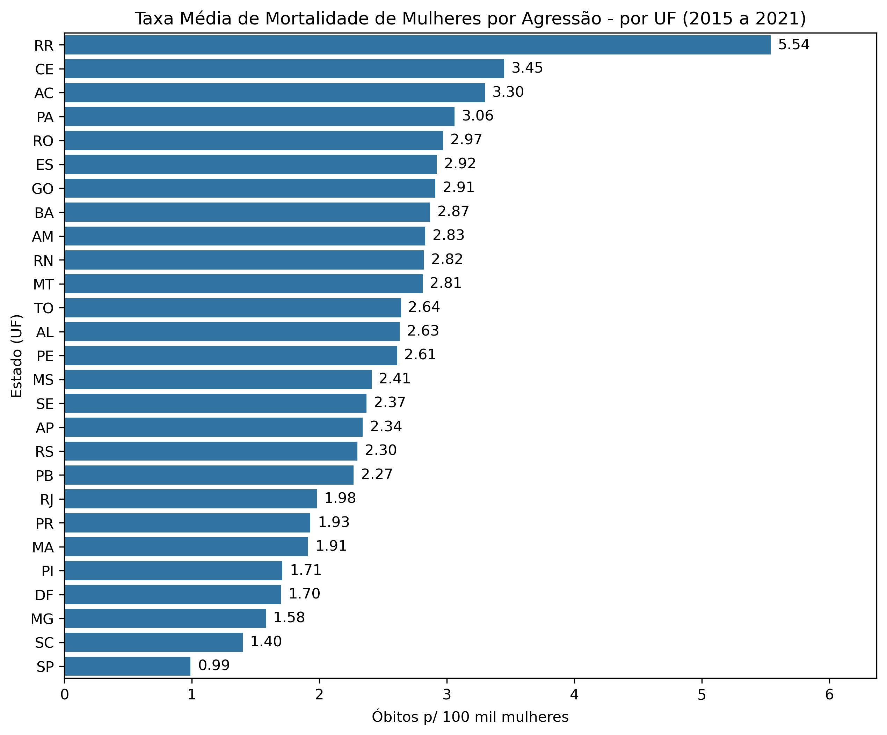
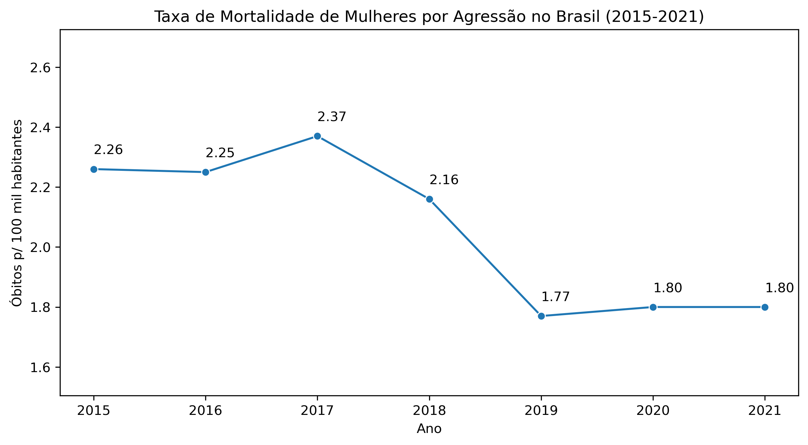
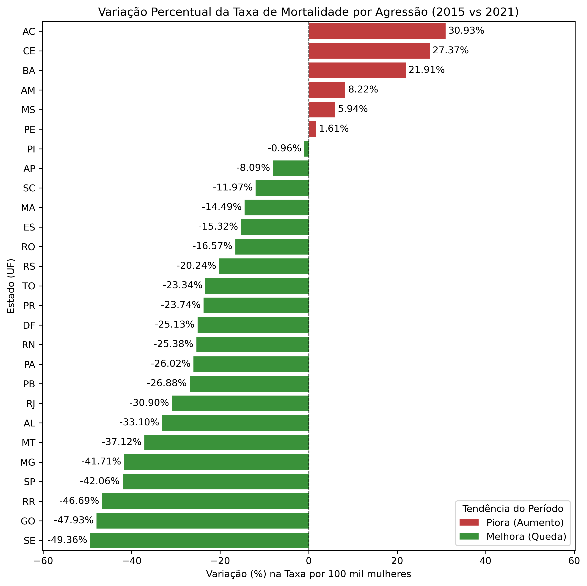

# Mortalidade por Violência contra Mulheres no Brasil (2015–2021)

Análise exploratória da mortalidade feminina por causas externas de agressão no Brasil, utilizando dados oficiais do DATASUS/SIM e estimativas populacionais do IBGE.

---

## Sobre o projeto

Este projeto investiga a evolução da violência letal contra mulheres no Brasil entre 2015 e 2021, com foco em disparidades regionais e tendências temporais. A análise utiliza a taxa de mortalidade por 100 mil habitantes como métrica principal, permitindo comparações justas entre estados com populações muito diferentes.

**Perguntas respondidas:**
- Quais estados concentram as maiores taxas de mortalidade por violência contra mulheres?
- Como essa taxa evoluiu ao longo do período analisado?
- Quais estados apresentaram melhora ou piora entre 2015 e 2021?

---

## Dados

| Fonte | Descrição |
|---|---|
| DATASUS/SIM (TABNET) | Óbitos femininos por agressão (CID-10: X85–Y09), 2015–2021 |
| IBGE SIDRA (Tabela 6579) | Estimativas populacionais por estado, 2015–2021 |

**Recorte:**
- Sexo: feminino
- Causas: CID-10 X85 a Y09 (agressões)
- Abrangência: 27 unidades federativas
- Período: 2015 a 2021
- Total de óbitos analisados: 30.085

**Nota metodológica:** Os dados cobrem 2015–2021, período mais recente disponível no DATASUS/SIM. Dados de mortalidade passam por processo de validação antes da publicação oficial, resultando em defasagem típica de 2–3 anos. Os dados foram obtidos diretamente via TABNET para garantir integridade — testes com a biblioteca `pysus` revelaram falhas silenciosas de download em múltiplos estados e anos.

---

## Visualizações

### Taxa média por estado (2015–2021)
Ranking das 27 UFs pela taxa média de mortalidade por violência contra mulheres no período.



### Evolução temporal nacional
Tendência da taxa de mortalidade nacional ao longo dos 7 anos analisados.



### Variação percentual por estado (2015 vs 2021)
Comparação entre o início e o fim do período — estados em vermelho pioraram, em verde melhoraram.



---

## Tecnologias utilizadas

- Python 3.11
- pandas
- matplotlib
- seaborn
- requests

---

## Estrutura do repositório

```
├── analise_mortalidade.ipynb     # Notebook principal com toda a análise
├── obitos_tabnet_2015_2021.csv   # Dados de óbitos exportados do TABNET
├── taxa_mortalidade_brasil.png   # Gráfico de evolução temporal
├── taxa_mortalidade_estados.png  # Gráfico de ranking por estado  
├── variacao_mortalidade_uf_2015_2021.png  # Gráfico de variação percentual
└── README.md
```

---

## Como reproduzir

1. Clone o repositório
```bash
git clone https://github.com/GustavoCyrilo/violencia_feminina_datasus.git
```

2. Instale as dependências
```bash
pip install pandas matplotlib seaborn requests
```

3. Execute o notebook `analise_mortalidade.ipynb` do início ao fim

> Os dados populacionais são obtidos automaticamente via API do IBGE ao executar o notebook. O arquivo `obitos_tabnet_2015_2021.csv` já está incluído no repositório.
